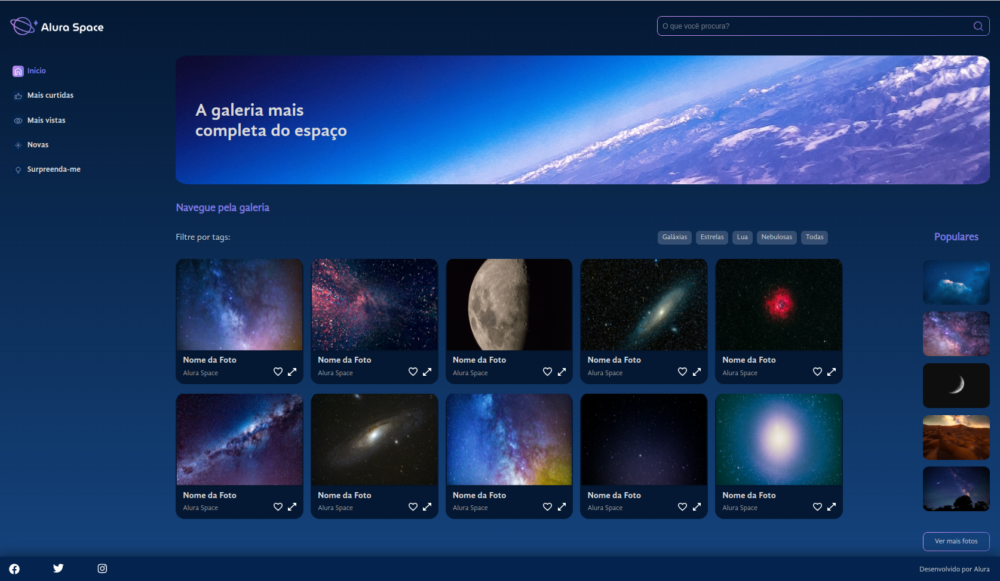
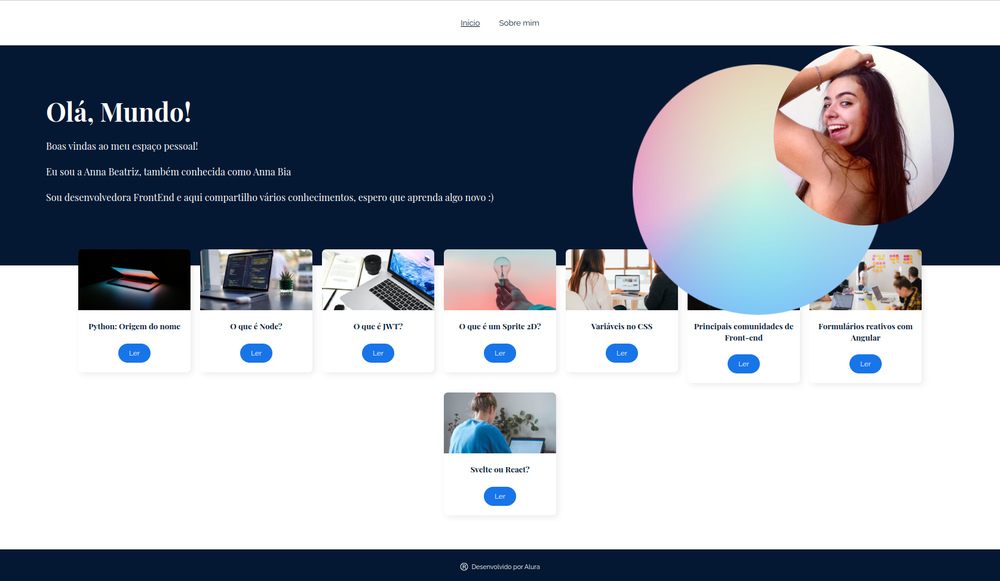
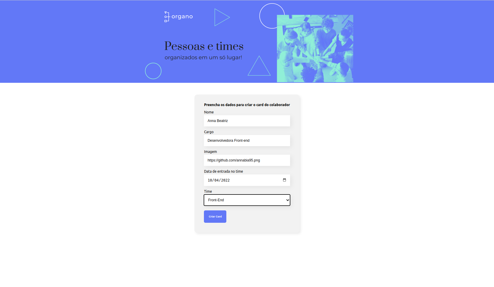
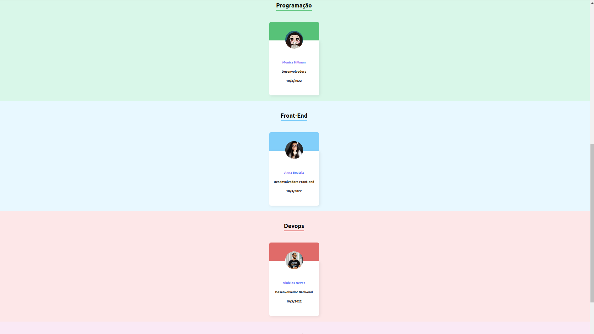

# Explore React com JavaScript - Alura ⭐

"React é um framework JavaScript utilizado para o desenvolvimento de interfaces do usuário em páginas web, com foco em criar single page applications (SPAs)."

Diante de toda facilidade, flexibilidade e escalabilidade do React, neste projeto tive como foco aprimorar os meus conhecimentos a respeito da implementação de componentes reativos, do roteamento da aplicação 
em React Router e das diferenças entre trabalhar utilizando JavaScript e TypeScript.

Tive como base a formação da Alura, composta por 7 cursos. 

Os layouts de algumas das páginas produzidas podem ser visualizados a seguir.

## Layout

Alura Space          
:-------------------------:|
  |

Hello World - Home           |        Hello World - About            |
:-------------------------:|:-------------------------:|
  |  |

Organo: TypeScript - Forms           |        Organo: TypeScript - Team             |
:-------------------------:|:-------------------------:|
  |  |

## Link para Deploy

[Alura Space](https://alura-space-puce-six.vercel.app/) 

[Hello World](https://hello-world-jade-three.vercel.app/) 

[Organo TS](https://organo-ts-wine.vercel.app/) 

## Certificado

Certificado            |         
:-------------------------:|
  |

## Habilidades Desenvolvidas

 - Componentes reativos e modulares;
 - Arquivos estáticos;
 - React Router;
 - Gerenciamento de estados globais: Context API;
 - TypeScript;
 - CSS Module;
 - SASS.

 
 ## Referências
[React](https://legacy.reactjs.org/docs/getting-started.html) 
[TypeScript](https://www.typescriptlang.org/docs/) 
[CSS Module](https://blog.logrocket.com/a-deep-dive-into-css-modules/) 
[SASS](https://sass-lang.com/) 
[HTML Element Reference](https://www.w3schools.com/TAGS/default.asp) 
[CSS Reference](https://www.w3schools.com/cssref/index.php) 
[Explore React com JavaScript - Alura](https://cursos.alura.com.br/formacao-react-javascript) 
